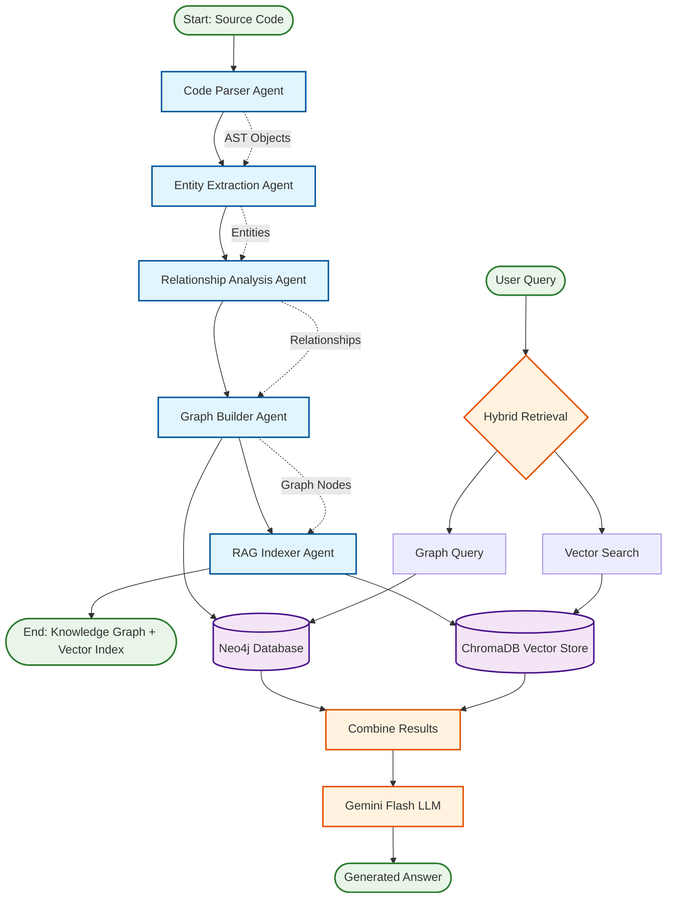

# Code Grapher Agent Flow

```mermaid
graph TD
    %% Code Grapher Agent Pipeline Flow
    START([Start: Source Code]) --> PARSE[Code Parser Agent]
    PARSE --> EXTRACT[Entity Extraction Agent]
    EXTRACT --> RELATE[Relationship Analysis Agent]
    RELATE --> GRAPH[Graph Builder Agent]
    GRAPH --> RAG[RAG Indexer Agent]
    RAG --> END([End: Knowledge Graph + Vector Index])

    %% Data Flow
    PARSE -.->|AST Objects| EXTRACT
    EXTRACT -.->|Entities| RELATE
    RELATE -.->|Relationships| GRAPH
    GRAPH -.->|Graph Nodes| RAG

    %% Storage Systems
    GRAPH --> NEO4J[(Neo4j Database)]
    RAG --> CHROMA[(ChromaDB Vector Store)]

    %% Retrieval Flow
    QUERY([User Query]) --> HYBRID{Hybrid Retrieval}
    HYBRID --> GRAPH_SEARCH[Graph Query]
    HYBRID --> VECTOR_SEARCH[Vector Search]
    GRAPH_SEARCH --> NEO4J
    VECTOR_SEARCH --> CHROMA
    NEO4J --> COMBINE[Combine Results]
    CHROMA --> COMBINE
    COMBINE --> LLM[Gemini Flash LLM]
    LLM --> ANSWER([Generated Answer])

    %% Styling
    classDef agent fill:#e1f5fe,stroke:#01579b,stroke-width:2px
    classDef storage fill:#f3e5f5,stroke:#4a148c,stroke-width:2px
    classDef process fill:#fff3e0,stroke:#e65100,stroke-width:2px
    classDef endpoint fill:#e8f5e8,stroke:#2e7d32,stroke-width:2px

    class PARSE,EXTRACT,RELATE,GRAPH,RAG agent
    class NEO4J,CHROMA storage
    class HYBRID,COMBINE,LLM process
    class START,END,QUERY,ANSWER endpoint
```
